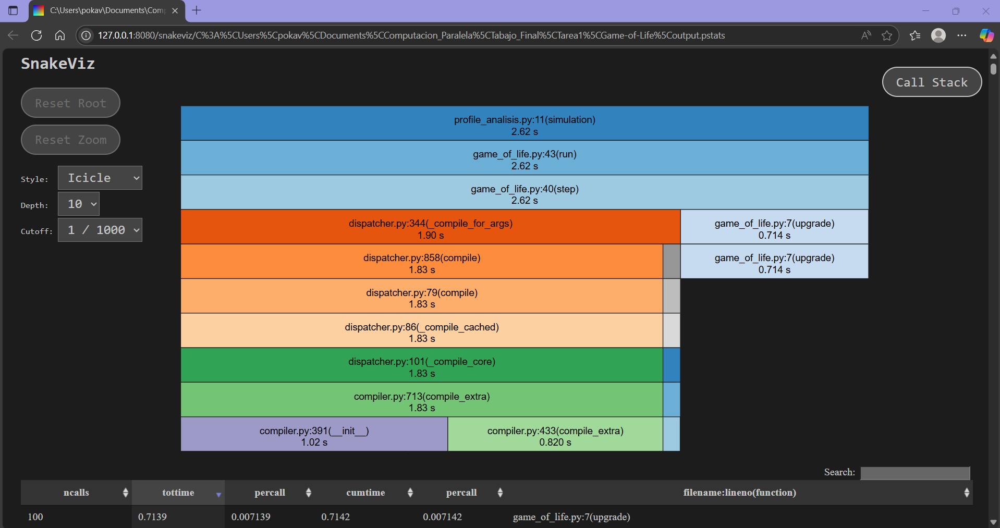
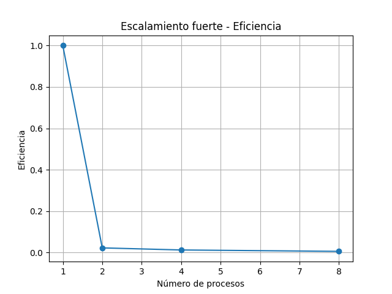
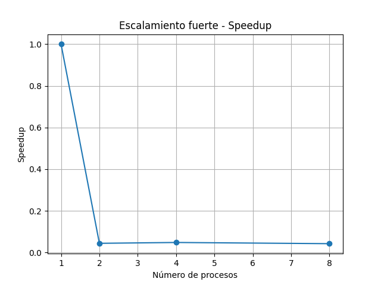
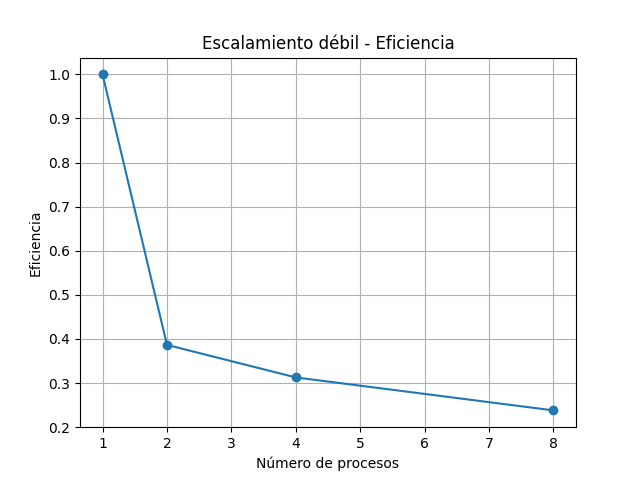
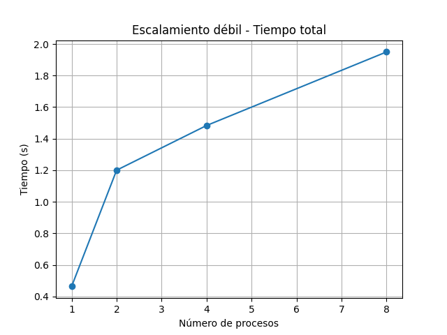

# Informe de Rendimiento - Juego de la Vida de Conway

## Herramientas de Perfilado

Se utilizaron las siguientes herramientas para el análisis de rendimiento:

- `cProfile` para obtener estadísticas globales por función.
- `line_profiler` para evaluar línea por línea funciones críticas como `step()` y `upgrade()`.
- Visualización con `snakeviz` de las trazas generadas.

---------------Analisis con Snakeviz y cprifle-------

Tabla comparativa de Output.txt

| Función (archivo\:línea)                | # Llamadas (`ncalls`) | Tiempo total (`tottime`) | Tiempo acumulado (`cumtime`) | Tiempo por llamada (`cumtime/ncalls`) |
| --------------------------------------- | --------------------- | ------------------------ | --------------------------- |---------------------|
| `simulation` (profile\_analisis.py:11)  | 1                     | 0.000 s                  | **2.618 s**                  | 2.618 s
| `run` (game\_of\_life.py:43)            | 1                     | 0.000 s                  | **2.616 s**                  | 2.616 s
| `step` (game\_of\_life.py:40)           | 100                   | 0.001 s                  | **2.616 s**                  | 0.026 s   
| `_compile_for_args` (dispatcher.py:344) | 1                     | 0.000 s                  | **1.901 s**                  | 1.901 s   
| `compile` (dispatcher.py:858)           | 17 / 1                | 0.000 s                  | **1.834 s**                  | ≈1.834 s       
| `_compile_cached` (dispatcher.py:86)    | 5 / 1                 | 0.000 s                  | **1.834 s**                  | ≈1.834 s   
| `_compile_core` (dispatcher.py:101)     | 5 / 1                 | 0.000 s                  | **1.834 s**                  | ≈1.834 s        
| `compile_extra` (compiler.py:713)       | 5 / 1                 | 0.000 s                  | **1.834 s**                  | ≈1.834 s    

---- analisis textual ------
Al analisis el archivo: output.txt se encuentra lo siguiente; la simulacion del juego con un grid the 512x512 durante 100 iteraciones registra 1,250,288 llamadas en 2,6s en donde la mayor parte del tiempo de desgaste se concentra en 3 funciones:
- simulation()
- GameOfLife.run()
- GameOfLife.step()
Las cuales se encargan de la ejecucion general, que cumplen funciones de iteracion sobre el tablero y actualizacion del estado de las celdas, lo cual se espera ya que se le conoce como el nucleo de la simulacion
Tambien se observa un bloque de tiempo consumida por JIT de aproximadamente 1.8s de compiladores que se asocian a numba, pero solo ocurren la primera vez que se ejecutan las funciones, por lo que la gran parde del tiempo consumido en realidad no se ve reflejada en el algoritmo en si, sino en la inicializacion del paso de optimizacion.
Una vez se se inicia, el costo desaparece en las ejecuciones posteriores.
Por ultimo, la funcion upgrade que se usa sobre cada "step" tomo 0.7s lo cual es razonable dado al tama;o de la grilla y el hecho de que se hacen operaciones sobre matrices. 
Como observacion a partir de investigaciones, es recomendable pre-calentar la funcion antes de realizar la perfilacion

## Escalabilidad Fuerte

| Procesos | Speedup | Eficiencia |
| -------- | ------- | ---------- |
| 1        | 1.00    | 1.00       |
| 2        | \~0.05  | \~0.03     |
| 4        | \~0.06  | \~0.015    |
| 8        | \~0.05  | \~0.006    |

## Analisis:
cuando se aumenta los procesos, el rendimiendo por otro lado no mejora. En terminos de speed y eficiencia los valores caen, lo que puede denotar que el paralelismo no se aprovecha. 
Entre las causas asimiladas:
- sobrecarga de coodinacion para grillas fijas
- ausencia de paralelizacion (no hay prange o parallel = True)
- si se comparan los costos de inicializacion vs los beneficios de dividir el problema, los primeros supean a los segundos.

## Escalabildiad debil 
| Procesos | Tamaño Grilla | Tiempo Total (s) | Eficiencia (estimada) |
| -------- | ------------- | ---------------- | --------------------- |
| 1        | 100x100       | \~0.45           | 1.00                  |
| 2        | 200x200       | \~1.2            | \~0.39                |
| 4        | 400x400       | \~1.5            | \~0.31                |
| 8        | 800x800       | \~1.95           | \~0.24                |

## Observaciones
- a pesar de que el tiempo aumente, se hace controladamente
- en terminos de eficiencia, esta disminuye a medida que los procesos aumentan pero si se compara con la escalabilidad debil, los resultados son aceptables.
- el sistema tiende a dar mejor respuesta en el momento que el tama;o del problema se incrementa al igual que los recursos.

## cuellos de botella
La función upgrade() es la más costosa debido a su uso intensivo de cálculos matriciales.

El tiempo de compilación inicial de Numba  representa un gran porcentaje del tiempo total si no se “precalienta”.

El uso de range en vez de prange evita la paralelización real, limitando el aprovechamiento de múltiples núcleos.

## Posibles optimizaciones
- usar parallel = True al igual que el prange
- restructuramiento del acceso a la grilla o tiling para el aprovechamiento de la memoria en terminos de jerarquia
- utilizacion de herramientas de multiperocesing para control mas especifico

## Conclusiones:
la version actual en terminos de carga fija no escala eficientemente, pero si se mide con una escalabilidad debil el comportamiento se vuelve mas eficiente, lo que significa que la implementacion obtiene una respuesta positiva cuando se imcrementa la carga en paralelo a los recursos disponibles.
